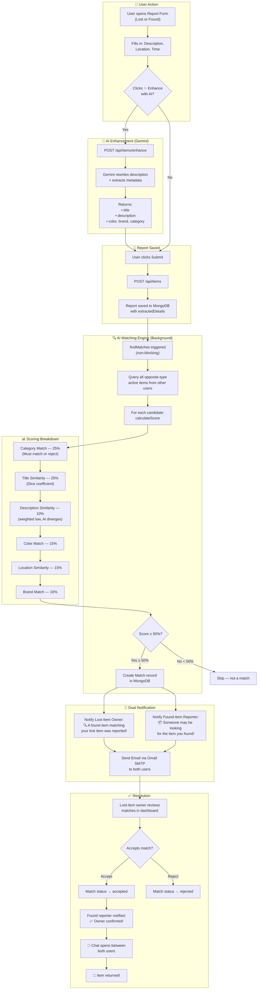
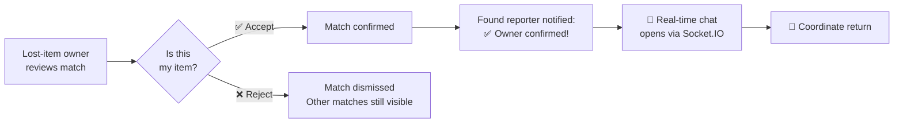
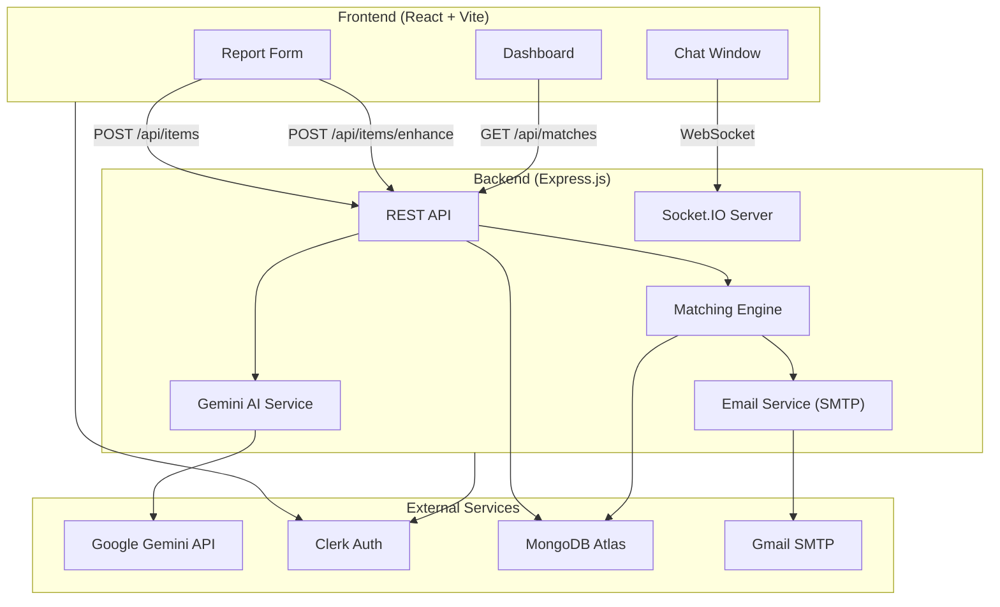

# Lost & Found — System Workflow

## Complete Flow: From Report Submission to Item Recovery

---

## Detailed Step-by-Step Breakdown

### Step 1: Report Submission

| Stage | What Happens | Code Location |
|-------|-------------|---------------|
| User fills form | Description, location, time entered | `AppPage.jsx` |
| AI Enhancement _(optional)_ | Gemini rewrites description + extracts `color`, `brand`, `category` | `aiService.js → POST /api/items/enhance` |
| Submit | Report saved to MongoDB with all metadata | `itemController.js → createItem()` |

> [!IMPORTANT]
> Clicking **"✨ Enhance with AI"** is critical for matching quality. Without it, `color`, `brand`, and `category` are empty — the match score drops by ~50%.

---

### Step 2: Matching Engine (Automatic, Background)

After a report is saved, `findMatches()` runs asynchronously:

1. **Query candidates** — fetches all opposite-type (`lost` ↔ `found`) active items from other users
2. **Score each pair** using the weighted algorithm:

| Factor | Weight | How It Works |
|--------|--------|-------------|
| **Category** | 25% | Hard gate — if both have categories and they don't match, score = 0. Uses fuzzy comparison (≥50% similarity) |
| **Title** | 25% | Dice coefficient on AI-generated titles |
| **Description** | 10% | Dice coefficient (weighted low — AI rewrites diverge) |
| **Color** | 15% | Exact/fuzzy string comparison |
| **Location** | 15% | Fuzzy comparison on user-entered location |
| **Brand** | 10% | Exact/fuzzy string comparison |

3. **Threshold**: Score ≥ **50%** creates a match

> [!TIP]
> When categories are missing (user didn't use AI enhance), the system falls back to **title similarity** as a gate — requiring ≥45% title match to prevent false positives like "Charger" ↔ "Wristwatch".

---

### Step 3: Notifications

When a match is found, **both users** receive:

| Recipient | In-App Notification | Email |
|-----------|-------------------|-------|
| **Lost-item owner** | 🔍 "A found item matching your lost _[title]_ was reported near _[location]_" | ✅ Full email with match details |
| **Found-item reporter** | 📦 "Someone may be looking for the item you found: _[title]_" | ✅ Full email with match details |

---

### Step 4: Resolution

---

### Step 5: Real-Time Chat

- Built on **Socket.IO** for instant messaging
- Chat is tied to a specific match (match ID = room ID)
- Both users receive in-app notifications for new messages:
  - 💬 "New message about _[title]_ — tap to continue the conversation"

---

## Architecture Overview

---

## Key Files Reference

| File | Purpose |
|------|---------|
| `aiService.js` | Gemini prompt + metadata extraction |
| `matchingService.js` | Scoring algorithm + match creation + notifications |
| `emailService.js` | Gmail SMTP transport + email templates |
| `clerkClient.js` | User email lookup from Clerk |
| `itemController.js` | Report CRUD + triggers matching |
| `matchController.js` | Match accept/reject + status notifications |
| `index.js` | Socket.IO chat + chat notifications |
